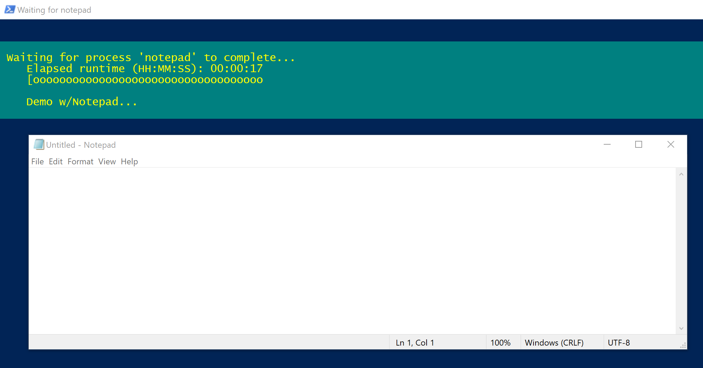

# Process Progress Indicator
Uses PowerShell ```Write-Progress``` cmdlet in a separate PowerShell Window as a progress indicator for a process.  This can be used to offer a visual indicator of progress for a long running hidden process.

## Installing
#### Download from GitHub repository

* Download the repository from https://github.com/ryan-leap/ProcessProgressIndicator
* Unblock the zip file ((on Windows) Right Click -> Properties -> [v/] Unblock)

## Usage
```powershell
# Dot-source the file to bring the function in scope
. .\Start-ProcessProgressIndicator.ps1

# Get help
Get-Help Start-ProcessProgressIndicator
```

## Examples
### Opens a separate PowerShell window which will display a progress meter until the process (notepad in this case) is stopped
```powershell
PS C:\> Start-ProcessProgressIndicator -Id (Start-Process notepad -PassThru).Id -CurrentOperation "Demo w/Notepad"
```


## Author(s)

* **Ryan Leap** - *Initial work*

## License

Licensed under the MIT License.  See [LICENSE](LICENSE.md) file for details.
